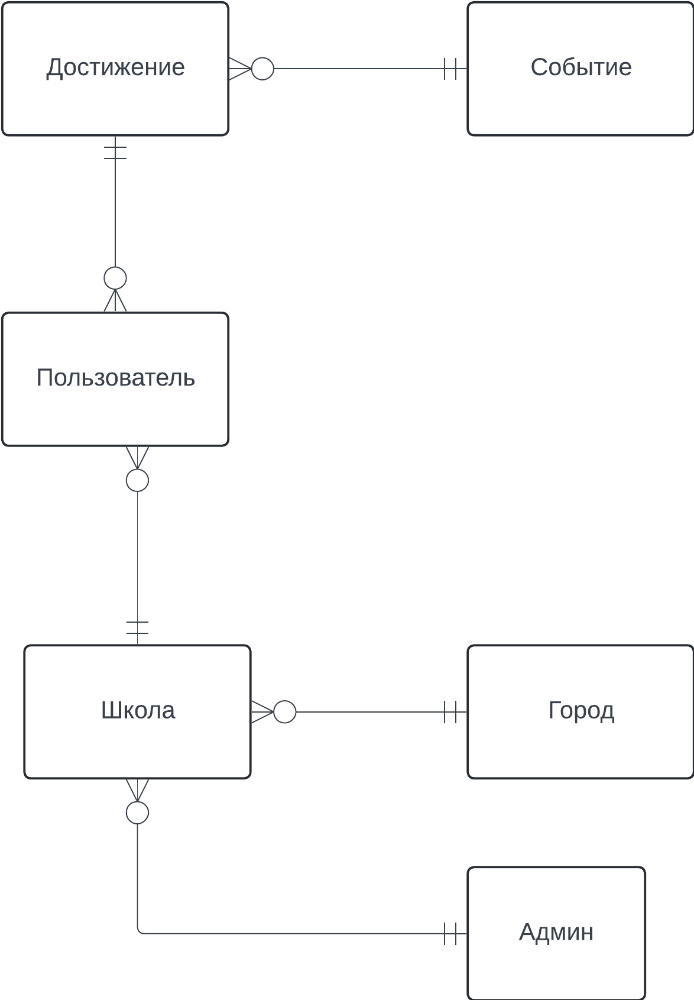
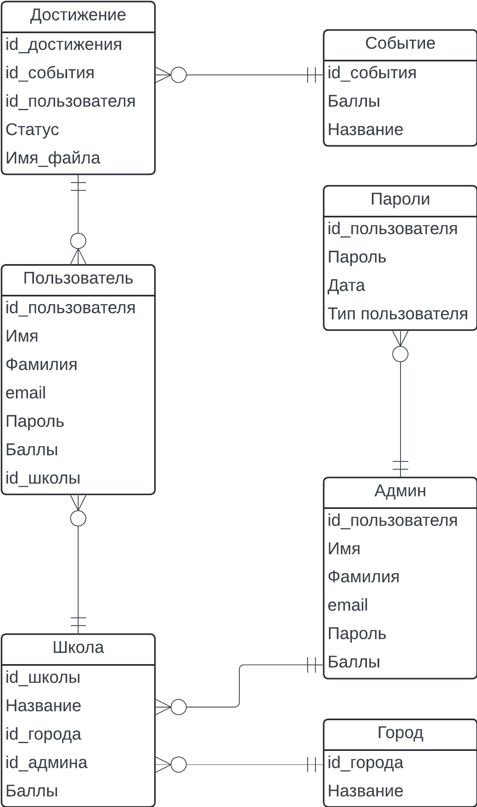
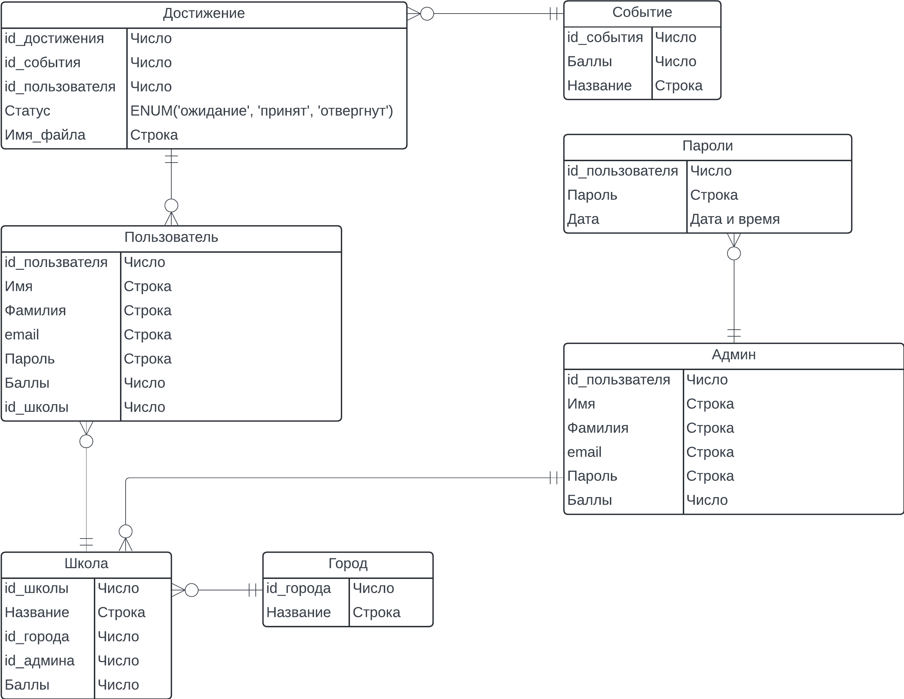

# Score_DB

## Концептуальная модель
Данная концептуальная модель представляет собой часть приложения для загрузки достижений и получения за них баллов. Каждый пользователь прикреплен к какой-то школе, а каждая школа закреплена за городом. Ученик школы может поучавствовать во внеучебной деятельности, а потом загрузить своё достижение в базу. Когда админ проверит и подтвердит достижение, ученик, школа, в которой он учиться, и адмиин, закрепленный за школой, получат баллы. Баллы школы сумма всех баллов учеников, баллы админа среднее арефитическое баллов всех школ админа. Админы закреплены за своими школами. К каждой школе приставлен ровно один админ.

## Логическая модель 
Данная модель соответствует третьей нормальной форме. Все атрибуты простые, каждый не ключевой атрибут неприводимо зависит от первичного ключа, не ключевые атрибуты нетранзитивно зависят от первичных ключей ("Пользователь" -> "Достижение" -> "Событие", "Пользователь" -> "Школа" -> "Город"). При создании логической модели была добавлена таблица с версионными данными SCD 4 "Пароли", которая хранит предыдущие пароли админов, чтобы админ при смене пароля не ставил старые (требование безопасности), последние 3 пароля ставить нельзя и предупреждение при попытке поставить пароль 4 по старости и выше.

## Физическая модель

При формировании физической модели базы данных были указаны ограничения на поля, а также типы данных. Были сформировалы [DDL-](src/ddl.sql) и DML-скрипты и написаны [запросы](src/queries.sql) к таблицам.

### [Event](src/event.sql)

| Название поля | Тип          | Ограничения           |
| ------------- | -----------  | --------------------- |
| id            | BIGSERIAL    | NOT NULL, PRIMARY KEY |
| score         | BIGINT       | NOT NULL              |
| name          | VARCHAR(50)  | NOT NULL, UNIQUE      |

### [Achievement](src/achievement.sql)

| Название поля | Тип                              | Ограничения                |
| ------------- | -------------------------------- | -------------------------- |
| id            | BIGSERIAL                        | NOT NULL, PRIMARY KEY      |
| event_id      | BIGINT                           | NOT NULL, FOREIGN KEY      |
| id_user       | BIGINT                           | NOT NULL, FOREIGN KEY      |
| status        | ENUM ('pending', 'ok', 'reject') | NOT NULL DEFAULT 'pending' |
| file          | VARCHAR(32)                      | NOT NULL                   |

> `file` - название файла без расширения, котрый подтверждает достижение.

### [User](src/user.sql)

| Название поля   | Тип                    | Ограничения                      |
| --------------- | ---------------------- | -------------------------------- |
| id              | BIGSERIAL              | NOT NULL, PRIMARY KEY            |
| first_name      | VARCHAR(50)            | NOT NULL                         |
| second_name     | VARCHAR(50)            | NOT NULL                         |
| email           | VARCHAR(50)            | NOT NULL, UNIQUE                 |
| password        | VARCHAR(64)            | NOT NULL                         |
| score           | BIGINT                 | NOT NULL, DEFAULT 0              |
| school_id       | BIGINT                 | NOT NULL, FOREIGN KEY, DEFAULT 0 |

> Если пользователь ещё не указал в какой школе учиться,
> то `school_id` имеет значение 0

### [Admin](src/admin.sql)

| Название поля   | Тип                    | Ограничения                      |
| --------------- | ---------------------- | -------------------------------- |
| id              | BIGSERIAL              | NOT NULL, PRIMARY KEY            |
| first_name      | VARCHAR(50)            | NOT NULL                         |
| second_name     | VARCHAR(50)            | NOT NULL                         |
| email           | VARCHAR(50)            | NOT NULL, UNIQUE                 |
| password        | VARCHAR(64)            | NOT NULL                         |
| score           | BIGINT                 | NOT NULL, DEFAULT 0              |

### [Password](src/password.sql)

| Название поля   | Тип         | Ограничения           |
| --------------- | ----------- | --------------------- |
| admin_id        | BIGINT      | NOT NULL, FOREIGN KEY |
| password        | VARCHAR(64) | NOT NULL              |
| date            | TIMESTAMP   | NOT NULL              |

### [School](src/school.sql)

| Название поля   | Тип         | Ограничения                      |
| --------------- | ----------- | -------------------------------- |
| id              | BIGSERIAL   | NOT NULL, PRIMARY KEY            |
| name            | VARCHAR(50) | NOT NULL, UNIQUE                 |
| city_id         | BIGINT      | NOT NULL, FOREIGN KEY            |
| admin_id        | BIGINT      | NOT NULL, DEFAULT 0, FOREIGN KEY |
| score           | BIGINT      | NOT NULL, DEFAULT 0              |

### [City](src/city.sql)

| Название поля | Тип         | Ограничения           |
| ------------- | ----------- | --------------------- |
| id            | BIGSERIAL   | NOT NULL, PRIMARY KEY |
| name          | VARCHAR(50) | NOT NULL, UNIQUE      |